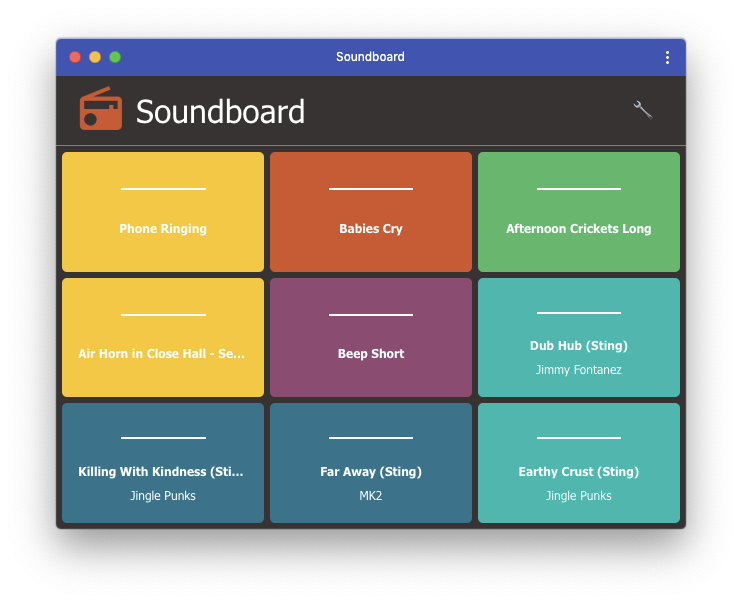

# Soundboard

This is a simple drag and drop soundboard app with MIDI support. It allows you
to load a number of audio files into different sound "blocks". Clicking a block
or pressing the corresponding key on your keyboard or MIDI device can then play
the audio file.



## How to use

The app [lives here](https://timendus.github.io/soundboard/), and can be used in
the browser or installed on your computer or tablet as a progressive web app
through your web browser. Mobile phones are currently "kinda" supported, but
configuration is pretty annoying.


When opened the app will greet you with lots of boring gray blocks. Click on any
of the blocks and select an audio file or drag and drop files into them to load
the blocks. Each block will randomly be assigned a starting colour. Clicking a
loaded block will trigger the sound to play.

**Please note:** The app will generate a number of blocks that comfortably fit
on your screen. If you resize the window this may mess things up, but the app
will not automatically add blocks or throw blocks away as you probably don't
want that. So the solution is to first resize your window, then refresh, then
start adding files.

**Also note:** The soundboard currently has no lasting memory. So when you leave
the page in your web browser or when you close the progressive web app, all your
sounds and settings will be lost. You will have to add them again next time.

## Settings

You can switch the app to settings mode by clicking the wrench in the top right
corner. In that mode you can manually add a row or a column if you run out of
space. And in settings mode you can change the playback mode, colour and
associated keyboard or MIDI key of your sound blocks.


### Playback modes

Soundboard has three:

* **Retrigger** (default, denoted by `-`) — Triggering the block repeatedly will
play the song from the beginning repeatedly. Mostly useful for sound effects and
drums.
* **OneShot** (denoted by `|`) — Triggering the block plays it, triggering again
stops playback. Mostly useful for things like background music.
* **Gate** (denoted by `o`) — Triggering the block and holding down the trigger
plays the sound. Releasing stops playback. Useful for short-lived variable
duration effects like applause.

### Using a MIDI device

MIDI is currently supported in Chrome, Opera, Microsoft Edge and a couple of
mobile browsers. See [this chart](https://caniuse.com/#feat=midi) for
compatibility.

To use a MIDI device with this soundboard, make sure it is a generic MIDI device
or that you have installed the necessary drivers to make your browser be able to
communicate with it. Then plug your device in before you start the soundboard.

Next, load your audio files, go to the settings mode and press the little
keyboard icon (the third circle) for one of the blocks. It will ask you to press
a key. Push one of the buttons or keys on your MIDI device, and it should
register that button or key with that block. Pressing it again should now
trigger the block.


## Developing

This should get you up and running locally:

```bash
$ git clone git@github.com:Timendus/soundboard.git
$ cd soundboard
$ npm install
$ npm start
```

PRs with improvements are welcome, as always. Feedback too. mail@timendus.com
